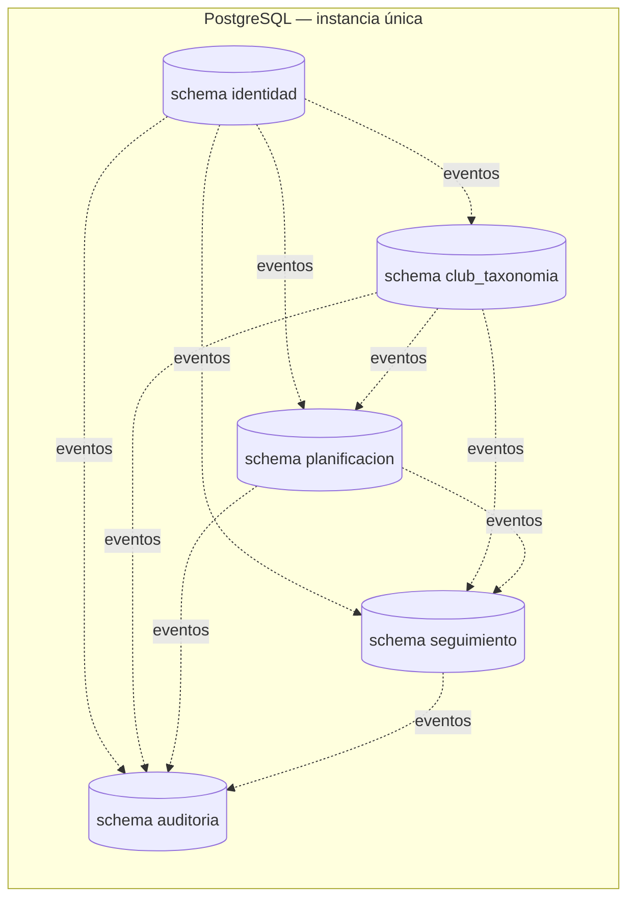

# ADR-0004 — Base de datos: PostgreSQL con un schema por módulo

- **Estado**: Aceptado
- **Fecha**: 2026-05-20 · revisado 2026-05-27 (reorganización Nivel 1: índice + premisas heredadas + NFRs + numeración de sub-decisiones; incorporación de tipos de datos estandarizados, reglas de migración online, JPA como ORM por defecto, eventos por módulo con compactación a 30 días, cifrado, backups, observabilidad de BD y diagrama de schemas) · revisado 2026-05-29 (D16 — borrado RGPD con modelo mixto; nota sobre RLS futuro) · **aceptado 2026-05-29**
- **Decisores**: Negocio (Antonio) · futuro equipo técnico
- **Relacionado con**: ADR-0001 (stack), ADR-0002 (modelo de datos), ADR-0003 (autenticación), ADR-0006 (infraestructura mono-tenant), ADR-0007 (monolito modular), ADR-0008 (arquitectura hexagonal y DDD), ADR-0011 (observabilidad), ADR-0014 (RGPD), `risks.md` (R16)

## Índice de sub-decisiones

Este ADR fija una **decisión arquitectónica compuesta** sobre la base de datos. Las dieciséis sub-decisiones se agrupan en seis áreas:

- **Paradigma y motor (D1-D2)** — qué tipo de base de datos y qué producto concreto.
- **Topología (D3-D5)** — una instancia para todo, schema por módulo, read models locales por eventos.
- **Tipos y extensiones (D6-D8)** — JSONB acotado, extensiones de PostgreSQL y estándares de tipos de datos.
- **Operación del esquema (D9-D12)** — migraciones, ORM, eventos por módulo y enforcement de fronteras.
- **Endurecimiento operativo (D13-D15)** — cifrado, backups y observabilidad de la BD.
- **Cumplimiento RGPD (D16)** — modelo de borrado de datos personales compatible con events-first.

| #   | Sub-decisión                                                                            | Capa         |
|-----|-----------------------------------------------------------------------------------------|--------------|
| D1  | [Paradigma relacional](#d1)                                                             | Estratégica  |
| D2  | [Motor PostgreSQL gestionado](#d2)                                                      | Estratégica  |
| D3  | [Una sola instancia para todo el MVP](#d3)                                              | Estratégica  |
| D4  | [Schema por módulo, sin FK cruzando fronteras](#d4)                                     | Estratégica  |
| D5  | [Read models locales por módulo, alimentados por eventos](#d5)                          | Operativa    |
| D6  | [`JSONB` solo para metadata variable de `TagValue`](#d6)                                | Operativa    |
| D7  | [Extensiones de PostgreSQL: `unaccent` y `pgcrypto`](#d7)                               | Operativa    |
| D8  | [Estándares de tipos de datos: `TIMESTAMPTZ`, UUID v7, `snake_case`, locale `es_ES`](#d8) | Estratégica |
| D9  | [Migraciones con Flyway por módulo + SQL plano + reglas online + revisión obligatoria](#d9) | Operativa |
| D10 | [JPA / Hibernate como ORM por defecto + criterio para SQL nativo](#d10)                 | Operativa    |
| D11 | [Tabla de eventos compartida, retención 30 días de eventos completados](#d11) | Operativa |
| D12 | [Enforcement blando de la frontera entre schemas](#d12)                                 | Operativa    |
| D13 | [Cifrado en reposo (KMS) y en tránsito (TLS 1.2+)](#d13)                                | Operativa    |
| D14 | [Política de backups: RPO ≤ 24h, retención 14-30 días, prueba de restore documentada](#d14) | Operativa |
| D15 | [Observabilidad mínima de la BD](#d15)                                                  | Operativa    |
| D16 | [Borrado RGPD: modelo mixto (PII física, derivado anonimizado)](#d16)                   | Estratégica  |

## Contexto y problema

Este ADR cierra **dos decisiones nucleares** que conviene no confundir:

1. **Paradigma y motor** — ¿relacional, documental o grafo? ¿qué producto concreto?
2. **Topología de persistencia** — cómo se reparte el almacenamiento entre los cinco módulos de ADR-0007 (monolito modular).

El modelo de datos (ADR-0002) tiene tags como entidad de primera clase, una relación N-M alumno⇄tag, grupos como consulta sobre tags, excepciones manuales y metadata estructurada en algunos valores de tag (fecha y distancia de las carreras). Además hay planes, sesiones, reportes, alertas, personalizaciones, usuarios, invitaciones, marcas privadas y un read model que resuelve el ritmo del alumno. La elección afecta a cómo se resuelven las consultas de pertenencia a grupo (el punto de rendimiento sensible, R16), a la independencia de los módulos, al ADR de infraestructura y a la capacidad del sistema de evolucionar sin reescrituras.

Alrededor de esas dos decisiones nucleares hay un conjunto de **sub-decisiones operativas** que típicamente se dejan al criterio del equipo en la implementación. Este ADR las **eleva al nivel arquitectónico** —tipos de datos, migraciones, ORM, eventos, cifrado, backups, observabilidad— porque cada una de ellas, mal tomada en el día 1, se paga con reescrituras costosas en el día 365.

## Premisas heredadas (no se revisan en este ADR)

Estas premisas vienen como **input cerrado** del contexto del proyecto. **No se revisan en este ADR** — se asumen y condicionan toda la decisión que sigue. Si alguna cambia, este ADR deja de ser válido y hay que abrir uno nuevo.

- **Monolito modular con cinco contextos** `identidad`, `club_taxonomia`, `planificacion`, `seguimiento`, `auditoria` (ADR-0007). El reparto y los nombres están fijados; este ADR solo decide *cómo* persistir esos cinco contextos.
- **Arquitectura hexagonal + DDD táctico con dominio puro** (ADR-0008). El acceso a datos vive en `infrastructure`; el dominio no conoce JPA ni SQL. Este ADR respeta esa frontera y no la revisa.
- **Mono-tenant en MVP con `club_id` desde el día 1** (ADR-0006). Toda tabla de dominio lleva `club_id`; las queries del MVP filtran por un único club, pero la generalización futura no obliga a migrar esquema.
- **Spring Boot 3.x sobre JVM** (ADR-0001). Spring Data JPA / Hibernate, Spring Modulith y el ecosistema de Postgres sobre JDBC están disponibles de serie. Este ADR no revisa el stack.
- **Nube con servicio Postgres gestionado disponible** (ADR-0006). RDS / Aurora, Cloud SQL o Azure Database for PostgreSQL son las opciones reales; este ADR no decide *cuál*, eso lo cierra ADR-0006.

## Requisitos no funcionales

Estas cifras son **restricciones** y condicionan tanto el dimensionado del pool de conexiones como las políticas de backup y observabilidad. La carga es baja (mono-club) y el modelo está acotado por ADR-0002 — ninguna de estas cifras exige técnicas distribuidas, sharding ni caché especializada.

| Dimensión | Valor |
|---|---|
| **Usuarios totales** | ~550 en el club piloto (ADR-0001). Dimensionar con holgura para ~1.000. |
| **Concurrencia pico** | < 100 conexiones simultáneas (ADR-0001). |
| **Volumen de datos** (techos heredados de ADR-0002) | Hasta 5.000 alumnos por club, 250.000 filas en `alumno_tag`, 1.500.000 filas/año en `plan_resuelto_por_alumno`, 100.000 filas/año en `personalizacion`. |
| **Latencia p95 — camino crítico** | < 100 ms para queries clave (resolución de pertenencia a grupo de ADR-0002 D3, lectura de vista "hoy" del alumno desde `plan_resuelto_por_alumno`). El p95 < 400 ms de ADR-0001 D1 sigue rigiendo para el resto. |
| **RPO** | ≤ 24 horas (un backup diario + WAL/point-in-time recovery). |
| **RTO** | ≤ 4 horas para restaurar a nueva instancia. |
| **Retención de backups** | 14 días en MVP; ampliar a 30 días si RGPD lo exige (ADR-0014). |
| **Tamaño inicial del pool HikariCP** | Calculado como `max_connections / N_instancias`; en MVP con una sola instancia, valor sugerido **10-20** conexiones (margen sobrado para < 100 concurrentes). Ver *Detalles de implementación*. |

A este orden de magnitud y con los índices que ADR-0002 ya prescribe, una sola instancia gestionada de PostgreSQL absorbe la carga sin caché aplicativa ni réplicas de lectura. El primer disparador para reabrir el dimensionado es la activación de **más de una instancia de aplicación** (ADR-0006), no el crecimiento de datos.

## Drivers de la decisión

- **Qué forma tiene el dato**: muchos tipos de entidad con relaciones claras (club, usuario, alumno, entrenador, tag, grupo, plan, sesión, reporte, alerta, personalización, invitación, marca privada) e **integridad referencial deseable dentro de cada contexto**.
- Necesidad de **consultas sobre tags** eficientes y de algo de **flexibilidad** para la metadata de los valores (ADR-0002 D1).
- Madurez y disponibilidad **gestionada en cualquier nube** (AWS/GCP/Azure — ADR-0006).
- Buen soporte desde el stack JVM (ADR-0001) y desde un equipo interno de 4 personas.
- **Datos de salud sensibles a RGPD** (ADR-0014) → cifrado en reposo y en tránsito + control directo del backup.
- **Privacidad fuerte de las marcas del alumno** (ADR-0002 D7) → frontera entre `seguimiento` y el resto reforzada por schema separado y eventos.
- Carga MVP baja: ~550 usuarios, <100 concurrentes, un club.
- Capacidad de **evolucionar sin reescrituras** — la topología debe permitir extraer un módulo a microservicio sin tirar el esquema.

## Opciones consideradas — paradigma

- **Opción A** — Relacional (PostgreSQL, MySQL/MariaDB).
- **Opción B** — Documental (MongoDB).
- **Opción C** — Grafo (Neo4j).

### Opción A — Relacional

- 👍 El modelo *es* relacional: entidades con relaciones FK, es el caso canónico.
- 👍 Integridad referencial y transacciones multi-entidad nativas — publicar un plan (snapshot + plan + N sesiones + personalizaciones) es trivial.
- 👍 Resolver un grupo = una intersección/`JOIN` sobre tags: el terreno natural de SQL (ADR-0002 D3).
- 👍 Encaje directo con Spring Data JPA; pool de contratación amplio.
- 👎 Las consultas de pertenencia a grupo requieren diseño de índices — no es "gratis" (mitigado: la escala es pequeña y los índices ya están especificados en ADR-0002).

### Opción B — Documental (MongoDB)

- 👍 Esquema flexible; la metadata variable de los tags encajaría de forma natural.
- 👎 Un tag **no es un documento**: es un valor del *catálogo del club* que muchos alumnos comparten. Embeberlo en el alumno **duplica el catálogo**; referenciarlo reconstruye un modelo relacional en un motor que no fuerza la integridad.
- 👎 Plan, sesión, reporte, snapshot y personalización cruzan entidades — se paga la flexibilidad documental y no se usa.
- 👎 Las queries de grupo cruzan varias entidades: terreno de SQL, no de un documental.

### Opción C — Grafo (Neo4j)

- 👍 *"Alumno tiene tags, grupo consulta tags"* suena a grafo.
- 👎 Es un malentendido: la relación alumno⇄tag es **N-M de un solo salto** — exactamente una tabla de enlace relacional. Un grafo se gana el sueldo con **travesías profundas y de longitud variable** (rutas, caminos más cortos, recomendaciones encadenadas) que Runcriticon no tiene ni contempla en su roadmap.
- 👎 Encaje más pobre con el stack JVM; servicio gestionado y pool de contratación más reducidos.

> **Nota de escala.** A ~550 usuarios y <100 concurrentes, *cualquier* paradigma rinde de sobra. La decisión no es de rendimiento bruto, sino de **encaje con el modelo** y **coste de equipo/operación**. En ambos gana lo relacional con claridad.

## Opciones consideradas — motor relacional

- **PostgreSQL** — relacional maduro; `JSONB` para la metadata flexible de los tags sin renunciar al modelo relacional; índices potentes (parciales, sobre expresiones, sobre `JSONB`); extensiones (`unaccent`, `pgcrypto`, `pg_stat_statements`); gestionado en las tres nubes (RDS/Aurora, Cloud SQL, Azure Database for PostgreSQL); excelente soporte en Spring Data JPA.
- **MySQL / MariaDB** — muy extendido y gestionado en todas las nubes, pero con soporte de JSON e índices más limitado que el `JSONB` de Postgres, sin `unaccent` nativo y sin equivalente potente a los índices parciales sobre expresiones que ADR-0002 D2 necesita. Ninguna ventaja decisiva para este caso.

## Opciones consideradas — topología

- **Opción A** — Un schema compartido, FK por todas partes.
- **Opción B** — Una instancia PostgreSQL, **un schema por módulo, sin FK cruzando fronteras**.
- **Opción C** — Una base de datos por módulo desde el día 1 (y posible *polyglot persistence*).

### Opción A — Schema compartido

- 👍 Lo más simple; integridad gratis en todas partes.
- 👎 Acopla los módulos por el esquema: extraer un módulo el día de mañana obliga a reescribir su acceso a datos. Es el *big ball of mud* que ADR-0007 quiere evitar.

### Opción B — Una instancia, un schema por módulo

Una sola instancia física de PostgreSQL. Internamente, **un *schema* por módulo**; ninguna FK cruza la frontera de un módulo; las referencias entre contextos son por **ID suelto** y los módulos hablan por puertos/API (ADR-0007 y ADR-0008).

- 👍 Independencia de dominios **real desde el día 1**: ningún módulo conoce el esquema de otro.
- 👍 Integridad fuerte **dentro** de cada contexto (FK y transacción por agregado).
- 👍 **Una sola pieza** que operar, respaldar y monitorizar — viable para un equipo de 4.
- 👍 Extraer un módulo a servicio en el futuro = levantar su *schema* a su propia base: trabajo acotado, no reescritura.
- 👎 Exige disciplina para no colar una FK cruzada (Spring Modulith la detecta en el build).
- 👎 Alguna consulta que sería un `JOIN` entre módulos pasa a ser dos llamadas o un *read model* local.

### Opción C — Una base de datos por módulo (y *polyglot*)

- 👍 Independencia máxima; cada dominio escala por separado.
- 👎 Cuatro bases que operar, respaldar, parchear y monitorizar — sobrecoste desproporcionado para un equipo de 4 y un MVP mono-club.
- 👎 Sin transacción cuando dos módulos deben quedar consistentes a la vez.
- 👎 El *polyglot* multiplica la experiencia que el equipo necesita. Es el "microservicios prematuros" que ADR-0007 ya rechazó, aplicado a la capa de datos.

## Decisión

Las quince sub-decisiones se desarrollan a continuación. Cinco son **estratégicas** (D1, D2, D3, D4, D8 — paradigma, motor, instancia única, schema por módulo y estándares de tipos de datos); las diez restantes son **operativas** (D5, D6, D7, D9, D10, D11, D12, D13, D14, D15) y derivan o implementan las anteriores.

<a id="d1"></a>
### D1 — Paradigma relacional

**Relacional**, por las razones desarrolladas arriba: el modelo del dominio *es* relacional (entidades, FK dentro de cada contexto, transacciones multi-entidad), la consulta de pertenencia a grupo (ADR-0002 D3) es un `JOIN` con `GROUP BY`/`HAVING` indexable, y los paradigmas alternativos no aportan ventaja real. Documental obligaría a duplicar el catálogo de tags o a renunciar a la integridad; grafo solo pagaría con travesías profundas que aquí no existen. La nota de escala confirma que a 550 usuarios el rendimiento bruto no es discriminante: la decisión la fija el **encaje con el modelo** y el **coste de equipo y operación**.

<a id="d2"></a>
### D2 — Motor PostgreSQL gestionado

**PostgreSQL** en su versión gestionada por la nube de ADR-0006. Tres razones concretas que pesan más que el empate aparente con MySQL:

- **`JSONB` con índices**. La metadata variable de `TagValue` (ADR-0002 D1 — fecha y distancia de carrera, vacía en otros tipos) vive en `JSONB` sin abandonar el modelo relacional. PostgreSQL soporta índices GIN sobre `JSONB` y operadores `->`, `->>`, `@>` con plan estable. MySQL/MariaDB tiene JSON pero su soporte de índices y operadores está por detrás.
- **`unaccent` + índices parciales sobre expresiones**. ADR-0002 D2 fija un índice `UNIQUE (club_id, unaccent(lower(trim(nombre)))) WHERE archivado_en IS NULL` sobre `TagKey` y `TagValue`. PostgreSQL ejecuta este patrón nativamente; MySQL/MariaDB no tiene `unaccent` de serie y sus índices parciales son más limitados. Sin esto, la unicidad insensible a acentos hay que sostenerla solo en aplicación, perdiendo la red de seguridad de la BD.
- **Disponible gestionado en cualquier nube**. RDS / Aurora (AWS), Cloud SQL (GCP), Azure Database for PostgreSQL (Azure). No hay *vendor lock-in* por el motor; el ADR-0006 decide *qué* proveedor sin reabrir esta decisión.

Como bonus, `pgvector` está disponible para casos futuros de búsqueda semántica (no entra en MVP) y la comunidad / pool de contratación es amplia.

<a id="d3"></a>
### D3 — Una sola instancia para todo el MVP

**Una única instancia de PostgreSQL gestionada** alberga los cinco schemas del monolito modular. Se descarta la Opción C (una base de datos por módulo) por las razones desarrolladas arriba: cinco bases para operar, parchear, respaldar y monitorizar son sobrecoste injustificado para un equipo de 4 y un MVP mono-club, y la consistencia entre módulos en el momento de publicar un plan (que toca Planificación y mantiene el snapshot de membresía calculado sobre Club y taxonomía) se complica sin necesidad. La separación lógica por schemas (D4) ya da la independencia de dominios real que el diseño pide; pasar a múltiples bases es **trabajo posterior** cuando un módulo se extraiga a microservicio, no día 1.

<a id="d4"></a>
### D4 — Schema por módulo, sin FK cruzando fronteras

El núcleo de la topología. **Un *schema* PostgreSQL por cada módulo de ADR-0007**: `identidad`, `club_taxonomia`, `planificacion`, `seguimiento`, `auditoria`. Reglas vinculantes:

- **Ninguna FK cruza la frontera de un schema.** Las referencias entre contextos se guardan como **ID suelto** (p. ej. una `Sesión` en `planificacion` guarda un `alumnoId`, no una FK a `identidad.usuario` ni a `club_taxonomia.alumno`).
- **Dentro de cada schema**, FK e integridad referencial son **obligatorias**. La consistencia transaccional vive en el agregado (ADR-0008) y allí el relacional hace su mejor trabajo.
- **Transacción acotada a un agregado / un módulo.** La consistencia entre módulos es **eventual** y la orquesta la capa de aplicación mediante eventos (D5, D11), no la base de datos.
- **Los módulos se comunican por eventos de dominio** (*events-first*, ADR-0007), nunca leyendo el schema de otro módulo. Ni siquiera con `SELECT` de solo lectura: una *query* cross-schema desde código de un módulo es un bug de arquitectura.

Conviene precisar qué hace DDD con la integridad: **no la elimina, la reubica**. *Entre* contextos desaparece la FK cruzada (la consistencia pasa a ser eventual); *dentro* de cada contexto el agregado sigue siendo la frontera de consistencia transaccional y la integridad es tan fuerte como siempre — y eso es exactamente lo que un motor relacional hace mejor que nadie.

El día que un módulo deba extraerse como microservicio, su schema se mueve a su propia base de datos: trabajo **acotado**, no reescritura. La topología del MVP es ya la topología que ese paso del futuro necesita encontrar.

<a id="d5"></a>
### D5 — Read models locales por módulo, alimentados por eventos

Cuando un módulo necesita consultar datos que viven en otro, **no lee el schema vecino**: mantiene una **proyección local** (read model) en su propio schema, materializada como tabla y alimentada por los **eventos de dominio** que el módulo vecino publica (D11).

Ejemplos del MVP:

- `seguimiento.plan_resuelto_por_alumno` (ADR-0002 D8) consume `PlanPublicado` y `SesionPersonalizada` (emitidos por `planificacion`) y `MarcaActualizada` (emitido por el propio `seguimiento`) para componer la vista "hoy" del alumno. **No** hace `JOIN` contra tablas de Planificación.
- La futura vista de "salud del club" (panel del admin, ya prevista en ADR-0007) será un read model en `club_taxonomia` que consume eventos de Planificación y Seguimiento — métricas agregadas sin tocar sus tablas fuente.

Consecuencias asumidas:

- **Consistencia eventual** entre módulos: el read model puede quedar momentáneamente desfasado tras el evento que lo dispara. Aceptable para vistas de seguimiento; si hace falta un refresco bajo demanda en algún caso, se ofrece como botón explícito en la UI, no como invalidación generalizada.
- **Consumidores idempotentes** (ya fijado en ADR-0002 D8): el `INSERT ... ON CONFLICT (...) DO UPDATE` es el patrón obligatorio en cualquier listener que escriba en un read model. Reprocesar un evento debe ser seguro.
- **Cero queries cross-schema**: si un read model no cubre el caso, la solución es enriquecer el read model o crear uno nuevo, **nunca** colar un `JOIN` cross-schema en SQL nativo.

<a id="d6"></a>
### D6 — `JSONB` solo para metadata variable de `TagValue`

`JSONB` se usa **únicamente** para el campo `metadata` de `TagValue` (ADR-0002 D1), donde el modelo legítimamente es heterogéneo por tipo (vacía para `nivel`, `{fecha, distancia}` para `objetivo`). En el dominio se manipula como `TagValueMetadata` (sealed class en Kotlin) y la serialización a JSON la hace **solo el mapeador en `infrastructure`** (ADR-0002 *Reglas de oro*, ADR-0008).

**Lo que no es `JSONB`** (importante porque la tentación existe):

- Las columnas estables de cualquier entidad — siempre tipadas relacionales.
- El `override` de `Personalizacion` (ADR-0002 D9) — aunque hoy se almacena como JSONB del shape de `Sesion` por pragmatismo, su acceso en código es siempre por mapeador tipado; no se trata como mapa genérico.
- Configuración del club, payload de eventos, audit logs, etc. — se persisten en columnas tipadas; si un evento tiene metadata variable, vive como columna `JSONB` propia con shape documentado, nunca como "bolsa de cualquier cosa".

Cruza con ADR-0002 D1 — esta sub-decisión es su contrapartida en la capa de persistencia.

<a id="d7"></a>
### D7 — Extensiones de PostgreSQL: `unaccent` y `pgcrypto`

Se habilitan **dos extensiones** desde la primera migración. Cualquier otra extensión que entre en el futuro pasa por revisión de ADR (o nota explícita en este ADR si es trivial).

- **`unaccent`** — la usa la unicidad insensible a acentos de la taxonomía (ADR-0002 D2). Para que sea utilizable en un índice hay que envolverla en una función `IMMUTABLE` propia (la propia `unaccent()` es `STABLE`); el script de la primera migración lo define.
- **`pgcrypto`** — habilitada para `gen_random_uuid()` y, sobre todo, como precursora del futuro UUID v7 nativo. En MVP los UUID v7 se generan **en aplicación** (Kotlin) usando una librería como `uuid-creator` o `java-uuid-generator` — ver D8. Cuando PostgreSQL 18 traiga generación nativa de UUID v7 se considera mover la generación a la BD; mientras tanto, `pgcrypto` queda disponible para uso puntual (firmas, hashes auxiliares, generación de aleatorios) sin necesidad de añadirla en migración futura.

Se rechaza habilitar más extensiones por anticipación. `pgvector` se evaluará cuando aparezca el caso real de búsqueda semántica; `pg_trgm` cuando aparezca la búsqueda fuzzy de tags; `postgres_fdw` solo si en el futuro hace falta vincular dos bases (escenario que el modelo de microservicio cubre por otro camino).

<a id="d8"></a>
### D8 — Estándares de tipos de datos: `TIMESTAMPTZ`, UUID v7, `snake_case`, locale `es_ES`

Cuatro estándares vinculantes desde la primera migración. Cada uno cierra una clase de bug recurrente y sin establecerlos en el día 1 se paga con migraciones costosas.

#### `TIMESTAMPTZ` obligatorio para todo campo temporal

Todo campo de fecha/hora se declara como **`TIMESTAMPTZ`** (timestamp con zona horaria almacenado en UTC). Nunca `TIMESTAMP` sin zona, nunca `DATETIME`, nunca `VARCHAR` con un ISO8601 dentro.

Razones:

- Los bugs de timezone son la primera causa de incidentes silenciosos en aplicaciones que arrancan con `TIMESTAMP`. La conversión implícita asume el timezone de la sesión, que varía entre máquinas, contenedores y replicas — el dato se corrompe en cuanto un nodo cambia su `TZ`.
- El cliente piloto es **España**, pero los datos son **datos de salud** (reportes de sesión, marcas, lesiones) que merecen la **máxima precisión temporal**. Un reporte que dice "hice la salida a las 7:00 AM" tiene que decir lo mismo si el servidor está en Madrid, en Frankfurt o en us-east-1.
- Cualquier alumno futuro fuera de la zona de España (viaje, mudanza, expansión a otro club) se beneficia sin que el equipo tenga que pensarlo. El coste de adoptar `TIMESTAMPTZ` desde el día 1 es **cero**; el coste de migrar después de un año de datos es enorme.

Implicación de codificación: el lado Kotlin usa `Instant` o `OffsetDateTime`, **nunca** `LocalDateTime` para campos persistidos.

#### UUID v7 obligatorio para PK e IDs

Todas las PK y todos los IDs de dominio son **UUID v7**. Generación en **aplicación (Kotlin)** mediante una librería estable (`uuid-creator` o `java-uuid-generator`) hasta que PostgreSQL 18 traiga `uuidv7()` nativo.

UUID v7 (RFC 9562) tiene un prefijo de timestamp Unix de 48 bits + entropía aleatoria. Frente a UUID v4:

- **Ordenable temporalmente**. Dos filas insertadas consecutivamente tienen UUID consecutivos: los índices B-tree se construyen de forma secuencial y la fragmentación cae drásticamente. En `plan_resuelto_por_alumno` (1.5M filas/año) esa diferencia se mide en factor x5-x10 sobre el coste de mantenimiento del índice respecto a v4.
- **Misma unicidad y seguridad** que v4. No es secuencial puro (los últimos 74 bits son aleatorios), así que sigue siendo no-adivinable — no se filtra orden temporal explotable.
- **Compatible con `UUID` de PostgreSQL** como tipo (el formato binario es idéntico), no requiere cambios de schema cuando se migre a generación nativa.

Razón principal: el ahorro de fragmentación en las tablas grandes (`plan_resuelto_por_alumno`, `alumno_tag`, audit log de Identidad). Con v4, cada `INSERT` aterriza en una hoja al azar del B-tree y obliga a *page splits*; con v7, los `INSERT` van casi siempre al final del índice.

Regla complementaria: **prohibido `UUID.randomUUID()` en código de producción** (genera v4). Se genera inline con `UuidCreator.getTimeOrderedEpoch()` (`uuid-creator`) en cada punto de construcción — typed IDs (`UserId.new()`, etc.) y `eventId` de integration events — sin una capa de servicio inyectable intermedia, que no aporta nada mientras un solo módulo la use. Un test ArchUnit (`UuidV7ArchTest`) prohíbe `UUID.randomUUID()` en todo `com.runcriticon` (ver *Estrategia de tests críticos*).

#### Naming: `snake_case` en BD, `camelCase` en Kotlin, mapeo explícito en JPA

Las tablas, columnas, índices y constraints en BD se nombran en **`snake_case`** (`plan_resuelto_por_alumno`, `archivado_en`, `idx_alumno_tag__tag_value_id`). Los campos en Kotlin son **`camelCase`** (`planResueltoPorAlumno`, `archivadoEn`). El mapeo entre ambos se hace de forma **explícita** en JPA:

- Anotación `@Column(name = "snake_case_name")` por defecto en entidades JPA, **o bien**
- `PhysicalNamingStrategy` configurada en Hibernate (`SpringPhysicalNamingStrategy` o equivalente) que transforme `camelCase` ↔ `snake_case` automáticamente, eliminando la necesidad de anotar campo por campo.

Razón: `snake_case` es el estándar PostgreSQL (todos sus catálogos, todas sus extensiones, todas las herramientas de admin), `camelCase` es el estándar JVM/Kotlin. Mezclarlos en cualquier dirección genera fricción en queries SQL escritas a mano y en lectura de logs. Hacer el mapeo automático y obligatorio es la única forma de no encontrarse en seis meses una mezcla de `camelCase` en BD por una migración descuidada.

#### Locale `es_ES.UTF-8` en el cluster

El cluster PostgreSQL se inicializa con locale **`es_ES.UTF-8`**. Razones:

- El cliente piloto es España; las collation de `ORDER BY` sobre nombres y tags con tildes ordenan en el orden esperado por el usuario.
- `LIKE` / `ILIKE` con tildes funcionan según las expectativas del usuario hispanohablante.
- Es trivial fijar al provisionar y costoso cambiar después.

**Convivencia con `unaccent` (D7)**: `unaccent` funciona **independientemente del locale** — opera a nivel de tabla de transliteración, no de collation. El locale `es_ES.UTF-8` y el `unaccent` aplicado en el índice de unicidad de la taxonomía conviven sin conflicto. El locale rige `ORDER BY` y `LIKE`; `unaccent` rige solo donde se invoca explícitamente.

Si en el futuro entra un club de otra región (Brasil, Francia…) la collation se evaluará por columna (PostgreSQL 12+ soporta collation por columna), sin necesidad de reinicializar el cluster.

<a id="d9"></a>
### D9 — Migraciones con Flyway por módulo + SQL plano + reglas online + revisión obligatoria

**Flyway** es la herramienta de migraciones desde el día 1. **Cero `ddl-auto`** en cualquier entorno real (ni siquiera `validate` salvo en arranque; en CI se prueba el camino completo desde cero).

Se eligió Flyway sobre Liquibase porque el proyecto escribe SQL específico de PostgreSQL (`JSONB`, `unaccent`, índices parciales sobre expresiones, `CREATE INDEX CONCURRENTLY`) y la abstracción agnóstica de motor de Liquibase no aporta valor con un único motor ya decidido.

Reglas vinculantes:

- **Cada módulo tiene su propia carpeta de migraciones y su tabla de historial** (`flyway_schema_history` por schema, configurada en Flyway). Las migraciones de `identidad` no son visibles ni aplicables desde el módulo `seguimiento` ni viceversa. La estructura de carpetas en el repo es:
  ```
  backend/src/main/resources/db/migration/identidad/
  backend/src/main/resources/db/migration/club_taxonomia/
  backend/src/main/resources/db/migration/planificacion/
  backend/src/main/resources/db/migration/seguimiento/
  ```
- **Versionado `V<timestamp>__<descripcion>.sql`**. `V20260601120000__crea_tabla_usuario.sql`. El timestamp como versión evita colisiones de número cuando varios PRs abren migraciones en paralelo.
- **SQL plano**, no `.java`. Es el formato más legible, el que mejor se lee en `git blame` y el que se ejecuta exactamente como está escrito.

**Reglas de migración online** (`ALTER TABLE` sobre tablas con > 100k filas):

- **Añadir columna**: `ALTER TABLE ... ADD COLUMN ... NULL` (sin default que reescriba la tabla) → poblar en bloques mediante script o migración programática → `ALTER TABLE ... ALTER COLUMN ... SET NOT NULL` cuando esté poblada. PostgreSQL 11+ permite `ADD COLUMN ... NOT NULL DEFAULT <constant>` sin reescribir, pero el patrón seguro se mantiene como estándar.
- **Crear índice**: siempre `CREATE INDEX CONCURRENTLY` en tablas > 100k filas. El bloqueo de tabla de un `CREATE INDEX` normal es minutos en `alumno_tag` y eso es downtime en horario laboral.
- **Añadir foreign key**: `ALTER TABLE ... ADD CONSTRAINT ... NOT VALID` (no valida filas existentes, no bloquea) → `ALTER TABLE ... VALIDATE CONSTRAINT ...` en una migración posterior (que escanea sin bloquear escrituras).
- **Borrar columna**: dos releases. Primera release: dejar de leer/escribir desde código. Segunda release: `ALTER TABLE ... DROP COLUMN`.

**Política de zero downtime**:

- **Código compatible con esquema viejo y nuevo durante una ventana de un release**. Una migración que añade una columna `email_verificado_en` y el código que la usa van en releases distintos: primero la migración (código sigue funcionando sin tocarla), después el código que la lee/escribe. Nunca al revés.
- Las migraciones se aplican antes del despliegue del código nuevo (paso del pipeline en ADR-0010).

**Migraciones reversibles**:

- Para cada `V__` se documenta el rollback. Si Flyway no soporta `R__` nativo para ese caso (la mayoría: borrar tabla, restaurar columna…), el rollback se documenta como **comentario al final del propio script `V__`** en SQL: lo que un humano ejecutaría para revertir. No es ejecución automática — es **playbook documentado** para que en una incidencia el on-call no improvise. Excepción aceptada: migraciones que destruyen información (borrar columna en la segunda fase del patrón anterior); el comentario lo deja explícito (*"sin rollback automático — restaurar desde backup point-in-time"*).

**Revisión obligatoria**:

- Cada PR que toca migración tiene la etiqueta `db-migration` en GitHub y **requiere al menos 1 reviewer adicional al autor** marcado como aprobador. La regla está en el `CODEOWNERS` o en la *branch protection*.
- En la fase MVP con equipo de 4, ese reviewer adicional es típicamente otro full-stack o el líder técnico; cuando crezca el equipo se nominará un DBA virtual o se rotará la responsabilidad.

**Test en CI con Testcontainers**:

- En cada PR, un job de CI levanta un PostgreSQL en Testcontainers desde cero y **aplica todas las migraciones** del proyecto en orden. Si fallan, el PR no merge. Verifica:
  - Que las migraciones nuevas son ejecutables sobre un esquema vacío.
  - Que no rompen un esquema ya migrado (re-aplicarlas tras las anteriores no falla).
  - Que el nombre del fichero sigue el patrón (validador propio del proyecto).

Cruce con **ADR-0010** (pipeline CI/CD): el test de migraciones es un quality gate obligatorio.

<a id="d10"></a>
### D10 — JPA / Hibernate como ORM por defecto + criterio para SQL nativo

**JPA / Hibernate** (vía Spring Data JPA) es el ORM por defecto para CRUD y consultas simples. Cubre el 80% del acceso a datos sin escribir SQL.

**SQL nativo** (vía `@Query(nativeQuery = true)` de Spring Data o `EntityManager.createNativeQuery`) se usa **solo** cuando se da alguna de estas tres condiciones:

- **(a)** La query cruza **más de 3 tablas** con `GROUP BY` / `HAVING` y la salida del ORM produce N+1 o un plan ineficiente. El ejemplo canónico es el SQL de resolución de pertenencia a grupo (ADR-0002 D3) — está escrito como SQL nativo desde el día 1.
- **(b)** El **plan SQL objetivo es claramente mejor** que lo que produce el ORM, y el equipo verifica con `EXPLAIN ANALYZE` que es el caso. No vale "creo que será más rápido"; vale "lo he medido y el plan generado por Hibernate hace un sequential scan donde uno escrito a mano usa el índice".
- **(c)** Usa **características específicas de Postgres no abstraidas por JPA**: operadores `JSONB` (`->`, `->>`, `@>`), CTEs recursivas (futuro árbol de grupo, ver ADR-0002 Notas), `EXCEPT` / `INTERSECT` (resolución de overrides en D3 de ADR-0002), funciones de ventana, etc.

**Reglas adicionales para SQL nativo**:

- **Siempre con parámetros nombrados o posicionales**, **nunca** concatenación de strings. La defensa frente a SQL injection es invariante.
- **El SQL nativo vive en `infrastructure`**, nunca en `domain` ni `application` (ADR-0008). Una constante de SQL en el dominio es un *code smell* que falla revisión.
- Las tablas referenciadas en SQL nativo son siempre del **schema propio del módulo** (D4). Una query con `JOIN seguimiento.marca_alumno` desde el módulo `planificacion` es un bug de arquitectura.

**Lo que se descarta para MVP**: jOOQ (más control, pero introducir una segunda capa de acceso a datos junto con JPA aumenta el coste cognitivo del equipo); Exposed (idiomático Kotlin pero rompe el patrón Spring Data que el equipo ya conoce). Si en el futuro JPA se queda corto para más casos de los previstos, se evalúa migrar partes a jOOQ — ADR aparte.

Cruce con **ADR-0008**: el ORM y el SQL nativo viven en la capa de infraestructura; el dominio no los conoce.

<a id="d11"></a>
### D11 — Tabla de eventos compartida, retención 30 días de eventos completados

Decisión clave para la consistencia eventual entre módulos. Dos reglas:

- **El outbox de Spring Modulith es una única tabla compartida `public.event_publication`**, gestionada por el framework (DDL estándar de Modulith: `id`, `listener_id`, `event_type`, `serialized_event`, `publication_date`, `completion_date`) — vive en `public`, fuera de cualquier schema de módulo, porque **es infraestructura del framework de mensajería, no dato de dominio de ningún módulo** (a diferencia de D4, que aplica a las tablas de dominio). No tiene columna de `aggregate_id` ni de tipo de evento en castellano: es el registro de entrega del framework, no un event store propio con semántica de negocio.
- **Retención de 30 días de eventos completados.** Un job programado borra de `event_publication` las filas con `completion_date` **no nulo** (entregadas con éxito a todos los listeners) y anteriores a 30 días. Las filas con `completion_date` nulo (pendientes o fallidas) **nunca se borran por retención** — son la cola de reintento/DLQ de ADR-0007 D13, y se gestionan por esa política, no por esta.

Estructura conceptual de la query de retención (sin agrupar por agregado — la tabla no tiene esa columna; borra fila a fila por `completion_date`):

```sql
DELETE FROM public.event_publication
WHERE completion_date IS NOT NULL
  AND completion_date < NOW() - INTERVAL '30 days';
```

Razón de la retención: el outbox de Spring Modulith sin límite explícito crece sin fin y el coste se manifiesta en un año, no en una semana. 30 días de eventos completados en bruto cubre la auditoría operativa reciente ("¿qué eventos disparó esta acción?"); pasado ese plazo, la reproyección de un read model corrompido se hace **reprocesando desde el consumidor** (republicando o recibiendo de nuevo el evento origen si el módulo emisor aún lo tiene, o desde el snapshot del read model — ver `docs/arquitectura/persistencia.md` §9), no leyendo `event_publication` como un log de estado por agregado: esta tabla nunca tuvo esa forma.

**Consideraciones**:

- No hay "compactación al último estado por agregado": esa idea requería una columna `aggregate_id` que la tabla real del framework no tiene. La reconstrucción de estado pasados los 30 días se apoya en los snapshots de proyección (`persistencia.md` §9), no en el outbox.
- El job de retención está cubierto por tests (ver *Estrategia de tests críticos*) para evitar borrar publicaciones aún pendientes (`completion_date IS NULL`).
- Cruce con **ADR-0007** (monolito modular / Spring Modulith): este es el contrato concreto del outbox de Modulith en este proyecto; D13 de ese ADR gobierna reintentos y DLQ de las filas no completadas.

<a id="d12"></a>
### D12 — Enforcement blando de la frontera entre schemas

**Un único usuario de BD** con acceso a los cinco schemas. Sin roles separados por schema en MVP.

El enforcement de la frontera entre módulos se sostiene con **tres capas blandas**:

- **Spring Modulith** verifica las dependencias **a nivel de paquete Java** en cada build. Una clase de `seguimiento` que importa una de `planificacion` falla compilación.
- **Test ArchUnit propio** que verifica que ninguna entidad JPA referencia otra entidad de schema distinto vía `@JoinColumn` (red de seguridad para lo que Modulith no cubre — Spring Modulith mira `import`s, no anotaciones JPA).
- **Revisión de PR** atenta a SQL nativo: una query con `JOIN <otro_schema>.tabla` se rechaza en revisión.

**Lo que NO se hace en MVP**: roles de BD separados por schema (un rol `identidad_app` con permisos solo en schema `identidad`, etc.). Es una decisión costosa de mantener (cada despliegue toca migraciones de permisos), de utilidad marginal mientras el monolito sea **un solo proceso** con **un solo usuario de BD**, y se reserva como **primer paso de una eventual extracción a microservicio**. Cuando un módulo se separe físicamente, su rol de BD propio nace ese día.

Cruce con **ADR-0007** (Spring Modulith) y **ADR-0008** (dominio puro): los tres ADRs sostienen colectivamente la frontera entre módulos. Este blando-pero-triple esquema es suficiente para un equipo de 4; un equipo de 40 pediría duro.

<a id="d13"></a>
### D13 — Cifrado en reposo (KMS) y en tránsito (TLS 1.2+)

**Ambos cifrados activados por defecto desde el día 1.**

- **Cifrado en reposo** — gestionado por el proveedor de la nube de ADR-0006 con la clave KMS por defecto del servicio (no se gestionan claves de encriptación a mano en MVP). Aplica al volumen de datos, a los snapshots de backup y a los logs persistidos. En RDS se activa con `StorageEncrypted=true`; en Cloud SQL es opt-in en la creación; en Azure es el comportamiento por defecto. La gestión de claves propias (CMK / customer-managed keys) se evalúa solo si un requisito de cliente concreto lo exige — ADR-0014 lo recogerá.
- **Cifrado en tránsito** — TLS 1.2 mínimo en cualquier conexión cliente ↔ BD. El cliente JDBC se configura con `sslmode=require` (o `verify-full` si el certificado del proveedor lo permite sin configurar CA bundle manual). La aplicación rechaza conectar sin TLS. La cadena de certificados la proporciona el proveedor gestionado y se confía en el bundle del propio proveedor (RDS root CA, Google Cloud SQL CA…).

**Razones**:

- **RGPD** (ADR-0014) — los datos de salud (reportes, marcas, lesiones) exigen medidas técnicas razonables. Cifrado activo es la línea base.
- **Coste cero** — RDS / Cloud SQL / Azure activan ambos cifrados sin penalización de rendimiento ni de precio detectable a esta escala.
- **Mitigación trivial**: si la BD se exfiltra (snapshot publicado por error, disco robado), el dato sigue cifrado.

Cruza con **ADR-0014** (RGPD). Cualquier otro endurecimiento criptográfico (cifrado a nivel de columna para campos especialmente sensibles, anonimización en backups…) lo decide ADR-0014 si lo necesita; este ADR fija la línea base universal.

<a id="d14"></a>
### D14 — Política de backups: RPO ≤ 24h, retención 14-30 días, prueba de restore documentada

Los backups del servicio gestionado son la línea de defensa última frente a corrupción, error humano destructivo (un `DELETE` sin `WHERE`) o fallo catastrófico de la instancia. Reglas:

- **Backups automáticos** del servicio gestionado activados desde el día 1. RDS automated backups, Cloud SQL automated backups o equivalente en Azure.
- **RPO objetivo: ≤ 24 horas.** Un backup completo diario + WAL (point-in-time recovery) cubierto por el servicio gestionado. La pérdida máxima aceptada de datos en caso de fallo catastrófico es de **un día**; los reportes del día perdido los reintroduce el alumno sin gran trauma.
- **RTO objetivo: ≤ 4 horas** para restaurar a nueva instancia. Es generoso para una beta y reduce el coste operativo de mantener réplicas activas. Si la beta confirma necesidad de RTO menor, se reabre con datos.
- **Retención**: **14 días en MVP**. Cubre la mayoría de incidentes de regresión silenciosa (un cambio que corrompe datos detectado a la semana). Se amplía a **30 días** si **RGPD** lo exige (ADR-0014, pendiente de cerrar el inventario completo de tratamientos).
- **Prueba de restore documentada y ejecutada trimestralmente.** Una vez por trimestre el equipo ejecuta una restauración real desde un backup a una instancia de prueba (entorno de staging) y **verifica que el backup es utilizable**: que el esquema sube, que las queries clave devuelven datos coherentes, que la aplicación arranca contra esa instancia. Sin esta prueba, el backup es teoría. El resultado se documenta en `docs/notas/restore-test-<fecha>.md` con el tiempo medido (input para verificar el RTO).

**Lo que NO entra en MVP**:

- Réplicas de lectura activas (no se necesitan a < 100 concurrentes).
- Replicación cross-region (no se necesita; un fallo regional severo del proveedor es asumible para una beta).
- Backup en bucket propio fuera del proveedor (sobreingeniería para MVP; reevaluación si una cláusula de cliente lo pide).

Cruza con **ADR-0006** (la nube concreta fija el cómo) y **ADR-0014** (RGPD podría exigir retención mayor).

<a id="d15"></a>
### D15 — Observabilidad mínima de la BD

La observabilidad del backend la fija **ADR-0011**. Este ADR fija solo el **mínimo que debe estar activo en la propia base de datos** desde el día 1 — sin esto, ADR-0011 no tiene de dónde leer.

- **`pg_stat_statements` activado** como extensión desde la primera migración. Habilita la captura agregada de estadísticas de ejecución por query — la herramienta básica para detectar regresiones de rendimiento y queries problemáticas en producción.
- **Slow query log activado**: queries que tardan **> 500 ms** se loguean con el plan (`auto_explain` con `log_min_duration = 500ms`). 500 ms es la línea por debajo de los 800 ms del p95 de login con Argon2id (ADR-0003) y por encima del p95 < 100 ms del camino crítico (NFR de este ADR) — captura los problemas sin generar ruido por queries legítimamente pesadas.
- **Métricas exportadas del servicio gestionado** (RDS CloudWatch metrics, Cloud SQL metrics, Azure Monitor): CPU, IOPS, conexiones activas, espacio disponible, latencia de I/O. **Replication lag** se añadirá cuando existan réplicas (futuro).
- **Alarmas mínimas** configuradas desde el día 1:
  - **Conexiones cerca del máximo**: > 80% del pool sostenido 5 min. Indica leak de conexiones o saturación.
  - **Espacio en disco**: < 20% libre. Aviso temprano antes de quedarse sin espacio (que tira la BD).
  - **CPU > 80% sostenido 5 min**: indica problema de query (típicamente un cambio de plan tras un `ANALYZE` o un nuevo patrón de uso).
  - **Slow queries**: número de queries > 500 ms en una ventana de 10 min por encima de un umbral configurado (sugerido: > 100). Detecta regresiones de rendimiento antes de que el usuario las note.

Cruza con **ADR-0011**: las métricas de RDS/Cloud SQL se exportan al sistema de observabilidad que ese ADR fije (Datadog, Grafana Cloud, CloudWatch, lo que sea). Las alarmas de este ADR son las **iniciales**; el operativo diario las refina.

<a id="d16"></a>
### D16 — Borrado RGPD: modelo mixto (PII física, derivado anonimizado)

ADR-0014 (RGPD) fija las obligaciones legales; este ADR cierra **cómo se materializan** en la BD cuando un alumno ejerce el derecho al olvido (DSAR — *Data Subject Access Request*). El modelo events-first (D11) y los read models locales (D5) imponen restricciones técnicas no triviales que hacen necesaria una decisión explícita: el borrado físico ingenuo deja eventos huérfanos con `aggregateId` que ya no se puede resolver; la anonimización ingenua deja PII en eventos antiguos sin compactar.

**Modelo mixto** como respuesta:

- **Datos personales identificables (PII)** — borrado **físico** tras DSAR. Aplica a: `identidad.usuario` (nombre, email, password_hash, eventos de auditoría D15 de ADR-0003), `club_taxonomia.alumno` (nombre, email cuando aplique), `seguimiento.marca_alumno` (privadas por D7 de ADR-0002 → borrado físico obligatorio).
- **Datos derivados sin PII directa pero ligados al sujeto** — **anonimización**, no borrado físico. El `alumno_id` se sustituye por un identificador anónimo único (`UUID v7` generado al ejecutar el DSAR) y se mantiene la fila para preservar agregados estadísticos del club. Aplica a: `seguimiento.reporte_sesion`, `planificacion.personalizacion`, snapshots de membresía (`planificacion.plan_snapshot_alumno`). El club retiene la métrica de uso; el individuo deja de ser identificable.
- **Datos del catálogo del club** (`TagKey`, `TagValue`, `Grupo`, `Plan`, `Sesion`): **no se tocan**. No contienen PII del alumno; pertenecen al club.

**Operativa concreta del DSAR**:

1. El admin del club (o el propio alumno mediante un endpoint con autorización fuerte) inicia el borrado en una pantalla específica.
2. El módulo `Identidad` emite un evento `BorradoAlumnoSolicitado(alumnoId, anonimoId)` con un `anonimoId` recién generado.
3. Cada módulo, al consumir el evento, ejecuta su rutina de borrado en su schema:
   - **PII** → `DELETE` físico.
   - **Derivados** → `UPDATE` sustituyendo `alumno_id = :alumnoId` por `alumno_id = :anonimoId`.
   - **Eventos en `event_publication` con `alumnoId` en el payload y `completion_date` nulo** (pendientes de entrega) → reescritura del payload sustituyendo el id antes de que se complete la entrega; no se borra la fila mientras siga pendiente (D11 la protege de la retención por ese mismo motivo).
   - **Eventos ya completados y purgados por la retención de 30 días** (D11) no requieren acción: la fila ya no existe. Si el DSAR llega dentro de esos 30 días y el evento sigue en `event_publication` con `completion_date` no nulo, se reescribe igual que el caso anterior antes de que el job de retención lo alcance.
4. Cada módulo emite un `BorradoAlumnoCompletado(alumnoId, moduloId)` para registrar progreso.
5. Cuando `Identidad` recibe los cuatro `BorradoAlumnoCompletado`, marca el DSAR como cerrado y emite `BorradoAlumnoConsumado(alumnoId)`. Se loguea en el audit log (ADR-0003 D15) con el `anonimoId` para trazabilidad interna sin re-vincular al sujeto.
6. **Plazo**: el ciclo completo debe terminar en **30 días naturales** desde el DSAR (límite RGPD del artículo 12.3, con extensión a 60 si la solicitud es compleja).

**Excepciones por requisito legal** (no aplica en MVP, anotado para futuro): si una autoridad obliga a retener datos personales por motivos legales (auditoría fiscal, investigación), el borrado físico se sustituye por una **retención bloqueada** que solo el admin con justificación legal puede consultar. No se implementa en MVP — si llega, se reabre.

**Lo que NO se hace**:

- **Borrado físico con cascada total** (FK `ON DELETE CASCADE` cruzando módulos): descartado. Rompería D4 (sin FK cruzando) y los eventos quedarían inconsistentes con las referencias.
- **Solo anonimización sin borrado físico de PII**: descartado. La PII en `identidad.usuario` o las marcas privadas en `seguimiento.marca_alumno` deben desaparecer realmente; mantenerlas anonimizadas en la misma tabla es indistinguible de "no borrar".
- **Soft-delete con `borrado_en TIMESTAMPTZ`** para todas las tablas: descartado para PII (RGPD pide borrado efectivo, no marca lógica accesible al admin) — sí se usa puntualmente para `TagKey`/`TagValue` por motivo distinto (ADR-0002 D10), no como mecanismo RGPD.

## Diagrama de schemas y dependencias por eventos

El diagrama muestra los cinco schemas como entidades aisladas dentro de una sola instancia PostgreSQL, y el flujo de eventos de dominio (D5, D11) entre ellos. `auditoria` es sumidero puro — consume eventos `AccesoDenegado`/`AccesoADatosSensibles` de los otros cuatro, no publica nada que otro módulo consuma.



Flechas = flujo de eventos de dominio. **Nunca** `JOIN` ni FK cruzando estos límites. Cada schema mantiene sus read models locales alimentados por eventos (D5).

## Detalles de implementación

Configuración menor que **no constituye decisión propia**: deriva de las sub-decisiones D1-D15.

- **Pool HikariCP**: tamaño calculado como `max_connections / N_instancias` (regla de oro para no agotar conexiones del lado servidor). En MVP con una sola instancia y `max_connections = 100` típico del servicio gestionado, el pool inicial es **10-20**. Configuración concreta:
  - `connection-timeout: 5s` — fail-fast si la BD está saturada.
  - `idle-timeout: 10min` — devuelve conexiones inactivas al pool.
  - `max-lifetime: 30min` — recicla conexiones largas (evita problemas con timeouts intermedios de balanceadores y proxies).
  - `leak-detection-threshold: 60s` — detecta conexiones no devueltas al pool y las loguea con stack trace.
- **`club_id` en todas las tablas de dominio desde la primera migración** (cruce con ADR-0006). Aunque MVP sea mono-tenant.
- **Versión de PostgreSQL**: **PostgreSQL 16** (LTS reciente al iniciar) o superior. Política de actualización idéntica al patrón de ADR-0001 D12 para JVM/Spring: cada nueva LTS dispara revisión en el primer trimestre tras su salida; la adopción se hace en la siguiente ventana de mantenimiento planificada, no como cambio urgente. No saltar dos majors a la vez.
- **`pgvector` solo como nota futura**: no entra en MVP. Si aparece un caso de búsqueda semántica (descripción libre de sesión, similitud entre alumnos por patrón de entreno), se evalúa habilitar; el motor lo soporta como extensión sin afectar al resto del esquema.

## Estrategia de tests críticos

Los tipos de test los fija **ADR-0010** (pirámide: unitarios + integración con Testcontainers + contrato API + ArchUnit + fronteras de Modulith). Esta sección señala qué **casos** del modelo de persistencia son los que duelen si fallan en producción. Si CI verde no cubre estos casos concretos, el ADR-0004 no se considera implementado.

| Ámbito | Caso crítico | Tipo de test | Por qué duele |
|---|---|---|---|
| **D4 — fronteras** | Una entidad JPA con `@JoinColumn` que apunta a una entidad de schema distinto → falla `SchemaFronterasArchTest`. Un método de repositorio con `@Query(nativeQuery = true)` cuyo SQL referencia el schema de otro módulo → falla el mismo test (regex sobre el texto de la query). | ArchUnit (`SchemaFronterasArchTest`) | Una FK cruzada o una query cross-schema colada degrada la topología a Opción A (schema compartido) silenciosamente. El día que se extraiga un módulo, el coste es proporcional al tiempo que llevaba sin detectarse. |
| **D8 — tipos** | Cualquier uso de `UUID.randomUUID()` en el código de producción → falla `UuidV7ArchTest` (la única generación legítima es `UuidCreator.getTimeOrderedEpoch()`, v7). El guard de `@Column` con `columnDefinition = "TIMESTAMP"` sin TZ **no existe todavía** — pendiente, no confundir con implementado. | ArchUnit | Sin el guardarraíl, los timestamps sin TZ y los UUID v4 entran por la puerta de atrás (un PR distraído, una librería que los introduce) y descubrir el problema un año después es caro. |
| **D9 — migraciones** | CI levanta PostgreSQL en Testcontainers y aplica **todas** las migraciones del proyecto desde cero en cada PR; si una falla, el PR no merge. Test propio que verifica que cada `V__` nueva contiene un comentario `-- Rollback:` al final del fichero (puede ser "sin rollback automático — restaurar desde backup"). | Integración con Testcontainers + test propio | Una migración rota llega a producción y la siguiente release la sigue sin que nadie lo note hasta que toca restaurar de cero o levantar un entorno nuevo. El rollback documentado es la diferencia entre "lo sabemos" y "lo improvisamos a las 3 AM". |
| **D11 — eventos** | Retención: filas de `public.event_publication` con `completion_date` no nulo y anterior a 30 días → borradas; filas con `completion_date` nulo (pendientes/fallidas) **nunca** se borran por este job. | Integración con Testcontainers (retención con datos sintéticos: mezcla de completadas/pendientes, dentro/fuera de los 30 días) | Un job de retención mal escrito borra filas pendientes → esos eventos nunca se reintentan y un listener se queda sin procesar un evento real. |
| **D13 — cifrado** | Test de integración que verifica que el cliente JDBC se conecta con `sslmode=require`. Un intento de configurar el cliente sin SSL es rechazado por la configuración de Spring Boot. | Integración | Cifrado mal configurado expone datos de salud sin TLS — incidente RGPD reportable. |
| **D16 — borrado RGPD** | Test de integración del flujo completo: dado un alumno con datos en los 4 módulos, ejecutar `BorradoAlumnoSolicitado` → verificar que (a) `identidad.usuario`, `club_taxonomia.alumno` y `seguimiento.marca_alumno` están físicamente borrados; (b) `seguimiento.reporte_sesion`, `planificacion.personalizacion` y los snapshots mantienen las filas pero con `alumno_id = anonimoId`; (c) ningún evento previo al borrado contiene el `alumnoId` original tras el barrido. Test de tiempo: el ciclo completo termina en < 30 días simulados. | Integración con Testcontainers | Borrado parcial deja residuos de PII en una tabla cualquiera = incidente RGPD reportable. Anonimización incompleta deja `alumno_id` original en eventos = mismo problema. La conformidad la verifica un test, no la buena intención del equipo. |

Los tests **D4** y **D8** son ArchUnit puro (rápidos, corren en cada compilación). Los **D9** y **D11** corren en CI con Testcontainers (un poco más lentos pero obligatorios). El **D13** es de integración contra una instancia de PostgreSQL en Testcontainers configurada con TLS.

## Consecuencias

### Positivas

- Un único motor y una única instancia cubren lo relacional y lo flexible — operación mínima para un equipo pequeño.
- Independencia de dominios real: el esquema de un módulo no acopla a los demás; cuando llegue la extracción a microservicio, es trabajo acotado.
- Integridad referencial y transacciones para los agregados de cada contexto (planes, reportes, snapshots de grupo, personalizaciones).
- **Estándares de tipos cerrados desde el día 1**: `TIMESTAMPTZ`, UUID v7, `snake_case` ↔ `camelCase` mapeado, locale `es_ES`. Cada uno cierra una clase de bug recurrente sin coste extra.
- **Outbox con retención acotada**: el outbox de Spring Modulith no crece sin límite — las entregas completadas se purgan a los 30 días; las pendientes se conservan hasta resolverse (D11, ADR-0007 D13).
- **Backups con prueba periódica**: el día que toque restaurar, el proceso está probado y el RTO se conoce.
- **Observabilidad activa desde el día 1**: `pg_stat_statements` y slow query log capturan regresiones de rendimiento antes de que el usuario las note.
- **Cifrado activado por defecto**: línea base RGPD cubierta sin coste adicional.

### Negativas / coste asumido

- Exige disciplina para no introducir FK cruzadas entre módulos; sin *enforcement* (D12 + tests) la topología degenera en la Opción A.
- Las consultas que cruzan módulos dejan de ser un `JOIN`: cada módulo mantiene **read models locales** alimentados por eventos, lo que introduce **consistencia eventual** y obliga a diseñar consumidores idempotentes.
- Las consultas de pertenencia a grupo requieren diseño de índices cuidadoso — está ya cubierto en ADR-0002, pero no es "gratis".
- Generar UUID v7 en aplicación añade una dependencia (`uuid-creator` o equivalente) que se mantiene hasta que PostgreSQL 18 traiga generación nativa.
- La política de migración online + revisión obligatoria + comentario de rollback añade ceremonia por PR de migración. Se asume conscientemente como inversión en evitar incidentes con tablas grandes.
- La prueba trimestral de restore consume tiempo del equipo (estimado 2-4 horas por trimestre). Sin ella, los backups son teoría.

### Riesgos y mitigaciones

- **Rendimiento de las queries de grupo a escala de ~5.000 alumnos** (R16) → índices ya prescritos en ADR-0002; medir con datos del club piloto; SQL nativo si JPA no rinde (D10).
- **Erosión de las fronteras** (una FK cruzada o una query cross-schema colada) → Spring Modulith + ArchUnit + revisión de PR (D12). Tres capas blandas que se refuerzan; ninguna basta sola.
- **Read model desfasado** → consistencia eventual aceptada; refresco bajo demanda en UI si algún caso lo exige; consumidores idempotentes obligatorios (D5).
- **Retención de eventos errónea** → test específico en CI que verifica que el job de retención nunca borra filas con `completion_date` nulo (ver *Estrategia de tests críticos* — D11). Sin este test, un bug en la consulta de retención borra un evento aún pendiente de entrega y lo descubrimos cuando un listener nunca lo procesa.
- **Migración online mal aplicada que bloquea una tabla grande** → revisión obligatoria de PR de migración + test en CI con Testcontainers + comentario de rollback. El patrón `ADD COLUMN NULL → poblar → SET NOT NULL` se documenta en el onboarding técnico; las migraciones que tocan tablas > 100k filas requieren explicitar en el PR cómo se aplican online.
- **Fallo en la prueba periódica de restore** (el backup existe pero el restore no funciona — esquema corrupto, dependencias rotas, secretos no disponibles) → la prueba se ejecuta trimestralmente precisamente para detectarlo en frío y no en caliente. Si la prueba falla, abrir incidente y bloquear releases que afecten al esquema hasta que el restore vuelva a verde.
- **`pg_stat_statements` con overhead perceptible** → la extensión tiene coste despreciable a la escala del MVP (< 1% CPU); si crece y se demuestra problema, se ajusta `pg_stat_statements.max` o se desactiva temporalmente — pero la línea base es activado.
- **Migraciones descontroladas** → Flyway obligatorio; `ddl-auto` rechazado en cualquier entorno real.

## Notas

- La elección concreta del servicio gestionado (RDS / Aurora vs Cloud SQL vs Azure Database for PostgreSQL) se cierra en ADR-0006 junto con la nube.
- El día que un módulo deba extraerse como microservicio, su schema se lleva a su propia base de datos; **ese** es el momento de evaluar si ese servicio en concreto justifica otro paradigma (documental, grafo…) según su patrón de acceso real — no se adelanta esa decisión ahora.
- Si en el futuro aparece una necesidad de búsqueda de texto avanzada o analítica pesada, se evalúa por separado (`pg_trgm`, `pgvector`, OLAP en BI separado); no condiciona esta decisión.
- **Path de generación nativa de UUID v7 en PostgreSQL 18**: cuando PostgreSQL 18 llegue con `uuidv7()` nativo y se adopte (política de actualización en *Detalles de implementación*), se evalúa mover la generación de UUID de la aplicación a la BD (`DEFAULT uuidv7()` en las columnas PK). El cambio es **aditivo** — el formato es el mismo, no se requiere migración de datos; solo se simplifica la inicialización de entidades nuevas.
- **Path de roles separados por schema**: el enforcement duro (un rol de BD por schema) se aplaza como primer paso de una eventual extracción a microservicio. Documentado en D12, no en MVP.
- **Path de retención de backups extendida**: si ADR-0014 (RGPD) cierra con exigencia de retención mayor a 14 días para datos de salud, se sube a 30 días en MVP por simple cambio de configuración del servicio gestionado.
- **Path de Row-Level Security (RLS) para multi-tenant**: el filtro por `club_id` lo aplica hoy la capa de aplicación (ADR-0008). Cuando se generalice a multi-tenant (post-MVP, ver ADR-0006), evaluar habilitar **RLS por schema** con políticas que filtren por `current_setting('app.club_id')` — la aplicación setea esa variable de sesión al inicio de cada transacción y la BD rechaza queries sin filtro. Es una **segunda línea de defensa** sin sustituir el filtro de aplicación, y la decisión vive en el ADR de multi-tenant cuando llegue; aquí se anota para que no se descubra desde cero.
- **Revisión del 2026-05-27 (Nivel 1 + RGPD)**: el ADR se reestructura con índice, premisas heredadas y NFRs explícitos, y se numeran las sub-decisiones D1-D16 con anchors para que cada una sea localizable y revisable de forma independiente. Se elevan al nivel arquitectónico decisiones que vivían tácitas en "detalles de implementación" del ADR original: estándares de tipos de datos (D8 — `TIMESTAMPTZ`, UUID v7, naming, locale), reglas de migración online (D9), criterio para SQL nativo (D10), eventos por módulo con compactación a 30 días (D11), cifrado (D13), backups con prueba de restore (D14) y observabilidad mínima (D15). Se añade **D16** — borrado RGPD con modelo mixto (PII física, derivado anonimizado), que cierra cómo se materializan las obligaciones de ADR-0014 cuando un alumno ejerce el derecho al olvido. Se añade el diagrama Mermaid de schemas y eventos. Alineado con ADR-0001, ADR-0002 y ADR-0003.
- **Revisión del 2026-07-11 (D11)**: corrige dos afirmaciones que nunca correspondieron al outbox real de Spring Modulith: (1) no hay una tabla `event` por módulo — es una única tabla compartida `public.event_publication` gestionada por el framework, coherente con `persistencia.md` §6 (que ya lo documentaba bien); (2) no existe columna `aggregate_id` ni `tipo_evento`, así que la "compactación al último estado por agregado" nunca fue implementable contra el esquema real — se sustituye por retención simple de eventos completados a 30 días. Se ajusta D16 (paso 3 del DSAR) para no depender del mecanismo retirado. Detectado por auditoría de drift documentación-código (23 docs, 61 hallazgos).
- **Revisión del 2026-07-11 (D8)**: corrige "servicio inyectable `UuidGenerator`" (nunca existió) por el mecanismo real, generación inline con `UuidCreator.getTimeOrderedEpoch()`. El test ArchUnit que D8 afirmaba que ya existía tampoco existía — `UUID.randomUUID()` (v4) estaba en uso real en `ActivateAccount.kt`/`InviteStudent.kt` para 3 `eventId`, corregidos a v7 en esta misma PR. Añadido `UuidV7ArchTest`. De paso se retira, de la misma fila de la tabla, una segunda afirmación falsa no relacionada (guard ArchUnit de `TIMESTAMP` sin TZ, tampoco implementado). Detectado por auditoría de drift documentación-código (23 docs, 61 hallazgos).
- **Revisión del 2026-07-11 (D4)**: la fila "D4 — fronteras" de la tabla de tests críticos describía dos guardarraíles (ArchUnit para `@JoinColumn` cross-schema, test propio para `@Query(nativeQuery=true)` cross-schema) que no existían — ninguno de los 5 archivos ArchUnit del proyecto los cubría. Implementados ambos en `SchemaFronterasArchTest` (pasan vacíos hoy: no hay `@JoinColumn` ni `nativeQuery` en el código todavía — solo `identidad` está implementado — pero morderán en cuanto aparezca el primer caso real). Verificado con fixture temporal que ambas reglas detectan la violación correctamente antes de confirmar el guard. Detectado por auditoría de drift documentación-código (23 docs, 61 hallazgos).
