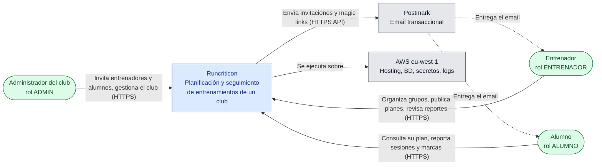
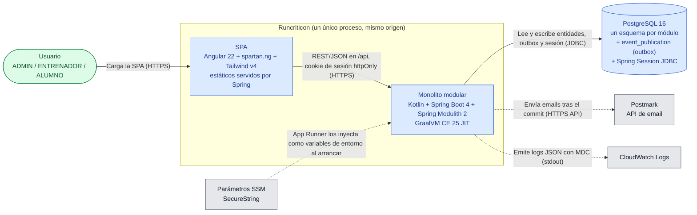
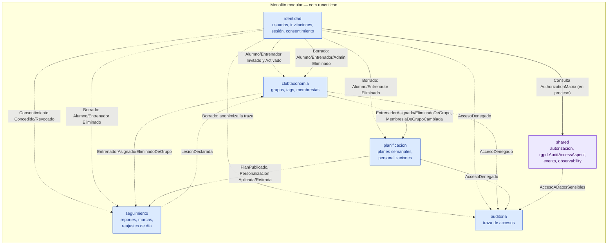
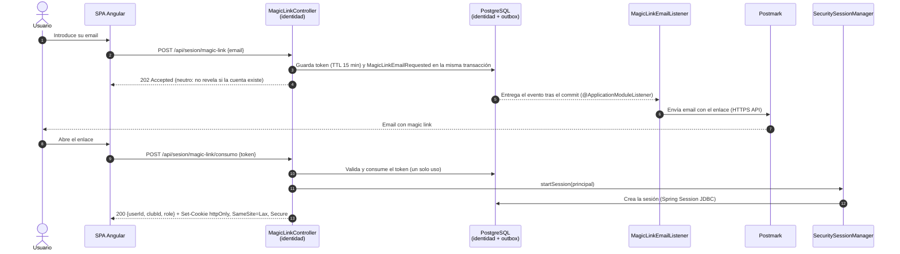
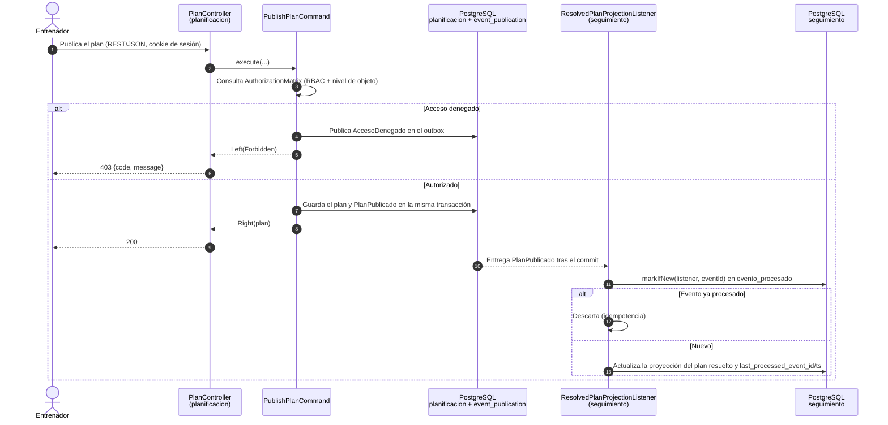
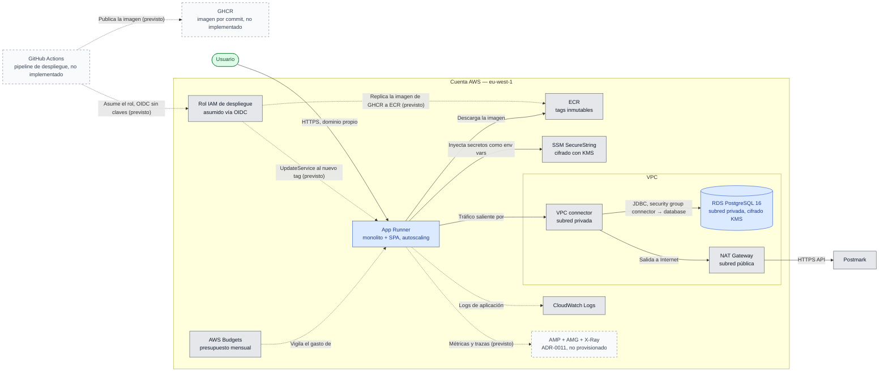

# Arquitectura de Runcriticon — diagramas

| Campo | Valor |
|---|---|
| Alcance | Vistas C4 (contexto, contenedores, componentes), dos secuencias clave y despliegue AWS |
| Estado | Refleja lo **implementado en `main`** (hito H0); el despliegue refleja el entorno `staging` de Terraform |
| Fecha | 2026-09-22 |
| Versión | 1.0 |
| Autor | avgarcia (con Claude Code) |
| Fuente de verdad | Los 17 ADRs de [`docs/adr/`](../adr/). Si un diagrama contradice un ADR, **gana el ADR** y el diagrama se corrige |

Todos los diagramas son Mermaid `flowchart`/`sequenceDiagram` y comparten notación:

| Elemento | Significado |
|---|---|
| Rectángulo azul | Sistema o contenedor **interno** de Runcriticon |
| Rectángulo gris | Sistema **externo** (SaaS o servicio de terceros) |
| Rectángulo verde redondeado | Persona usuaria (actor) |
| Cilindro | Almacén de datos |
| Rectángulo con borde discontinuo | Decidido en un ADR pero **aún no implementado ni provisionado** |
| Flecha sólida `-->` | Llamada **síncrona** (petición/respuesta); apunta al que recibe la petición |
| Flecha discontinua `-.->` | Flujo **asíncrono** (evento, email); apunta al consumidor |
| Recuadro (subgraph) | Límite: sistema, proceso, red o cuenta |

Siglas: **SPA** (Single Page Application), **C4** (Context-Container-Component-Code), **RDS** (Relational Database Service), **SSM** (AWS Systems Manager Parameter Store), **KMS** (Key Management Service), **OIDC** (OpenID Connect), **GHCR** (GitHub Container Registry), **ECR** (Elastic Container Registry), **VPC** (Virtual Private Cloud), **NAT** (Network Address Translation), **AMP/AMG** (Amazon Managed Prometheus / Grafana), **RBAC** (Role-Based Access Control), **RGPD** (Reglamento General de Protección de Datos).

---

## 1. C4 nivel 1 — Contexto del sistema

**Público**: producto y negocio. **Pregunta**: ¿quién usa Runcriticon y con qué sistemas externos habla?

Notas:

- **Mono-club** en el MVP ([`vision.md`](../vision.md)); `club_id` ya viaja en datos y sesión desde el día 1 (ADR-0006, ADR-0009).
- **Rol único por usuario** en el MVP (ADR-0003); multi-rol aplazado (ADR-0015).
- Acceso **solo por invitación** (ADR-0003): no hay registro abierto.
- El admin también recibe email (reset de contraseña); se omite la flecha para no recargar.

---

## 2. C4 nivel 2 — Contenedores

**Público**: arquitectura y liderazgo técnico. **Pregunta**: ¿qué piezas desplegables hay y cómo se comunican?

Notas:

- **Mismo origen**: la SPA y `/api` los sirve la misma aplicación Spring Boot; sin CORS, sin SSR, sin GraphQL (ADR-0001). El frontend **nunca** lee tokens desde JS (ADR-0003).
- El cliente HTTP del frontend se **genera desde OpenAPI** (ADR-0001 D10, ADR-0012 D12).
- La aplicación **no usa el SDK de AWS**: App Runner inyecta los parámetros SSM como variables de entorno y Spring los lee de `Environment` (ADR-0013).
- La sesión es **Spring Session JDBC** desde el día 1 (ADR-0006 D4 revisada).
- Se envía email por Postmark (ADR-0005). No hay endpoint de webhook entrante de Postmark implementado aún, aunque el secreto ya existe en SSM.

---

## 3. C4 nivel 3 — Componentes: módulos y eventos

**Público**: desarrollo. **Pregunta**: ¿qué *bounded contexts* hay dentro del monolito y qué eventos intercambian?

Ninguna llamada síncrona cruza módulos (ADR-0007): todo va por *integration events* publicados en el outbox de Spring Modulith (`event_publication`), y cada consumidor mantiene una **proyección local**. Las flechas agrupan eventos por familia; la tabla siguiente es la referencia completa.

Leyenda adicional: el recuadro violeta es el **núcleo compartido** (`com.runcriticon.shared`), usado en proceso por todos los módulos; solo se dibuja una de esas dependencias síncronas para no saturar.

### Tabla de integration events (fuente: `api/events/` y `@ApplicationModuleListener` en `main`)

| Evento | Productor | Consumidores (listener) |
|---|---|---|
| `AlumnoInvitado`, `AlumnoActivado`, `EntrenadorInvitado`, `EntrenadorActivado` | identidad | clubtaxonomia (`PersonProjectionListener`) |
| `AlumnoEliminado`, `EntrenadorEliminado` | identidad | clubtaxonomia (`StudentDeletionListener`), planificacion (`PlanificacionDeletionListener`), seguimiento (`SeguimientoDeletionListener`), auditoria (`AuditTrailAnonymizationListener`) |
| `AdminEliminado` | identidad | clubtaxonomia (`StudentDeletionListener`), auditoria (`AuditTrailAnonymizationListener`) |
| `ConsentimientoConcedido`, `ConsentimientoRevocado` | identidad | seguimiento (`ConsentProjectionListener`) |
| `EntrenadorAsignadoAGrupo`, `EntrenadorEliminadoDeGrupo` | clubtaxonomia | planificacion (`GroupMembersProjectionListener`), seguimiento (`CoachGroupProjectionListener`) |
| `MembresiaDeGrupoCambiada` | clubtaxonomia | planificacion (`GroupMembersProjectionListener`), clubtaxonomia (`MergeSuggestionListener`, autoconsumo) |
| `PlanPublicado` | planificacion | seguimiento (`ResolvedPlanProjectionListener`) |
| `PersonalizacionAplicada`, `PersonalizacionRetirada` | planificacion | seguimiento (`PersonalizationProjectionListener`) |
| `MarcaActualizada`, `MarcaRetirada` | seguimiento | seguimiento (`MarkPaceRecalculationListener`, autoconsumo) |
| `ReporteRegistrado`, `DiaReajustado` | seguimiento | — (sin consumidor todavía) |
| `LesionDeclarada` (`shared.api.events`) | seguimiento (`RescheduleDayCommand`) | clubtaxonomia (`LesionDeclaradaListener`) |
| `AccesoDenegado` (`shared.api.events`) | identidad, clubtaxonomia, planificacion (`*AccessAuditor` y casos de uso) | auditoria (`AuditEventListener`) |
| `AccesoADatosSensibles` (`shared.api.events`) | `shared.rgpd.AuditAccessAspect` (`@AuditaAcceso`) | auditoria (`AuditEventListener`) |

Los eventos internos de identidad (`InvitationEmailRequested`, `MagicLinkEmailRequested`, `PasswordResetEmailRequested`) **no** son integration events: no salen del módulo y solo disparan el envío de email.

---

## 4. Secuencia — Inicio de sesión por magic link

**Público**: desarrollo y seguridad. **Pregunta**: ¿cómo se autentica un usuario sin contraseña? (ADR-0003, ADR-0005)

Notas: los dos endpoints son `@NoAuthRequired`. Un fallo de Postmark no revierte la solicitud: el envío ocurre en la transacción del listener, posterior al commit del caso de uso.

---

## 5. Secuencia — Publicación de un plan y proyección en seguimiento

**Público**: desarrollo. **Pregunta**: ¿cómo viaja un cambio entre módulos sin llamada síncrona? (ADR-0007, ADR-0009 D9)

Notas: el listener restaura el MDC (`MdcRestorerForEvents`) al empezar y lo limpia en `finally`. Si la proyección acumula más de 60 s de retraso, las lecturas que dependen de ella fallan cerradas con `ProjectionStale` (ADR-0009 D9). Un evento que falla queda sin completar en `event_publication`; no hay reintento con *backoff* (ADR-0007).

---

## 6. Despliegue — AWS `eu-west-1` (entorno `staging`)

**Público**: operación y arquitectura. **Pregunta**: ¿dónde se ejecuta cada contenedor? Fuente: [`infrastructure/terraform/`](../../infrastructure/terraform/) (módulos `network`, `runtime`, `database`, `secrets`, `observability`, `cicd`).

Notas:

- **Pipeline de despliegue aún no implementado**: en `.github/workflows/` solo existen `ci.yml` y `adr-site.yml`. Sí están en Terraform el proveedor OIDC, el rol de despliegue y el ECR. Diseño previsto (ADR-0010 D2): GHCR como registro primario y ECR como réplica por entorno, de la que tira App Runner. Rollback = redesplegar un tag anterior (ADR-0010 D12).
- RDS PostgreSQL 16 en **Single-AZ** (`multi_az = false` por defecto); Multi-AZ aplazado (ADR-0015).
- Hoy solo existe el entorno `staging` (más `localstack` para desarrollo); producción queda por provisionar.
- AMP/AMG/X-Ray están **decididos** (ADR-0011) pero no hay recursos Terraform todavía. Por eso, como el pipeline, llevan borde discontinuo.
